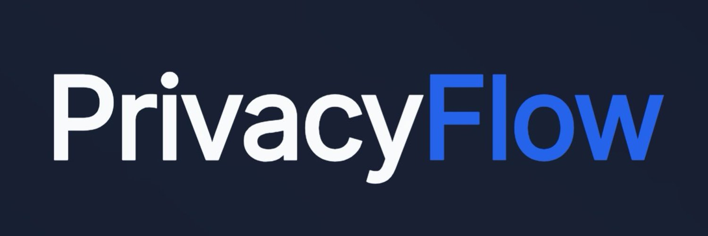
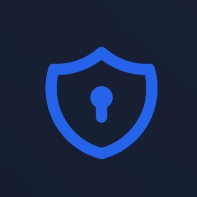

# PrivacyFlow Channel — Agent Zero Plugin

> Connect Signal, SimpleX, and Session to [Agent Zero](https://agentzero.ai) via [PrivacyFlow](https://privacyflow.ai). Bi-directional messaging, no bridge service required.

The plugin runs entirely inside Agent Zero using two extension hooks:

1. **`job_loop`** — Starts a background poller that fetches incoming messages from PrivacyFlow's public API every few seconds. Each message is forwarded to the appropriate Agent Zero context via `context.communicate()`.
2. **`process_chain_end`** — When the agent finishes processing, extracts the last response and sends it back to PrivacyFlow via the send API. Long messages are automatically split to fit messenger length limits.

## Features

- Bi-directional messaging via Signal, SimpleX, and Session
- WebUI configuration screen with a **Test Connection** button
- Automatic message splitting per messenger length limits
- Graceful steering under load — queued messages, no dropped turns
- Chats persist across Agent Zero restarts (`state.json` context mapping)
- Auto-retry on send failures with in-chat error logging

## Requirements

- [Agent Zero](https://agentzero.ai)
- Python 3.11+
- A PrivacyFlow account with an API key and App ID
- `requests` (declared in [`requirements.txt`](./requirements.txt); bundled with Agent Zero)

## Installation

### Option A — Agent Zero plugin installer

Once listed in the [a0-plugins](https://github.com/agent0ai/a0-plugins) community index, install directly from the Agent Zero UI: **Plugins → Browse → PrivacyFlow Channel → Install**.

### Option B — Manual (git clone)

```bash
git clone https://github.com/privacyflow/privacyflow-agent-zero-channel.git
```

Copy (or symlink) the cloned folder into your Agent Zero `plugins/` directory.

## Configuration

Configure via the Agent Zero WebUI (recommended) or environment variables.

### WebUI (recommended)

Open the PrivacyFlow Channel config screen in Agent Zero and fill in:

| Field | Description |
|-------|-------------|
| **API Base URL** | PrivacyFlow public backend API URL (e.g. `https://api.privacyflow.tech`) |
| **API Key** | Your PrivacyFlow API key (generate from your dashboard under App Settings) |
| **App ID** | Your PrivacyFlow App ID (one per instance) |

Click **Test Connection** to run a health check, auth verification, and app ID authorization check in one go.



### Environment variables (fallback)

The plugin reads WebUI config first, falling back to environment variables set in your Agent Zero `.env` file.

| Variable | Required | Description |
|----------|----------|-------------|
| `PF_API_BASE` | Yes | PrivacyFlow public backend API URL |
| `PF_API_KEY` | Yes | PrivacyFlow API key for poll + send |
| `PF_APP_ID` | Yes | PrivacyFlow app ID (one per instance) |

At startup the plugin verifies your API key and app ID against the PrivacyFlow API. If either is invalid, it logs an error and does not start the poller — check the Agent Zero logs.

## Supported Messengers

| Messenger | Char limit per message |
|-----------|------------------------|
| Signal | 2000 |
| SimpleX | 8000 |
| Session | 2000 |

Messages exceeding the limit are automatically split at paragraph, line, or word boundaries and sent as separate chunks.

## Message Handling

- **One context per contact/group** — mapping is persisted to `state.json`, so the same Agent Zero chat is reused across polls and restarts.
- **Group replies** — `contactId` is optional for sending. Replies target the app's active messenger group by default (resolved by the messenger, or supplied as a group id); `contactId` is only needed for direct (1:1) replies.
- **Graceful steering** — if the agent is busy when a new message arrives, it is queued. When the agent finishes, the stale response is discarded and the most recent queued message is dispatched. Older queued messages remain visible in the chat UI.
- **Send retry** — if a reply chunk fails to send, the plugin retries once after 1 second. If it still fails, the error is logged in the chat so dropped replies are visible.
- **Per-context locks** — concurrent dispatch tasks for the same contact are serialized to prevent race conditions.

## Architecture

```
PrivacyFlow Public API
        ↕
  pf_client.py (poll + send, auth verify)
        ↕
  job_loop/_10_pf_poll.py  →  context.communicate(UserMessage)
  (state.json: contact→context mapping, per-context asyncio locks)
        ↕
  Agent Zero processes message
        ↕
  process_chain_end/_50_pf_reply.py  →  send_message() back to PF
  (message splitting + retry + error logging)
```

## Troubleshooting

| Symptom | Likely cause | Fix |
|---------|--------------|-----|
| Poller doesn't start | Auth verification failed | Check API key and App ID in the WebUI config |
| "App ID not authorized" | App ID not associated with this API key | Verify in your PrivacyFlow dashboard |
| Messages not arriving | Wrong API base URL or health check failing | Click **Test Connection**; verify the URL |
| Replies not delivered | Send failure (network or API error) | Check Agent Zero logs — failures are logged in-chat |
| Agent responds to an older message | Graceful steering under load | Expected behavior — newest message wins |
| Chat resets on restart | `state.json` missing or corrupted | Delete `usr/plugins/privacyflow_channel/state.json` to reset |

## Development

```bash
git clone https://github.com/privacyflow/privacyflow-agent-zero-channel.git
cd privacyflow-agent-zero-channel

# Run tests
python3 -m unittest test_50_pf_reply -v

# Syntax check all Python files
find . -name '*.py' -not -path './.git/*' -exec python3 -m py_compile {} \;
```

Branch naming: `feat-*`, `fix-*`, `chore-*` (required to trigger CI workflows).

## License

MIT — see [LICENSE](./LICENSE).
